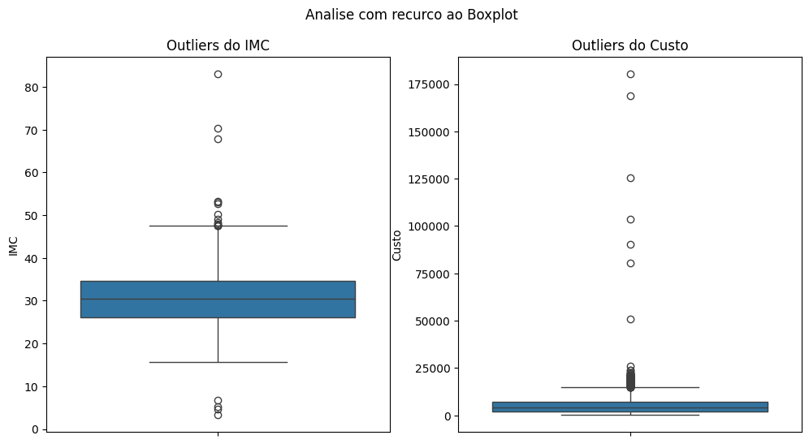
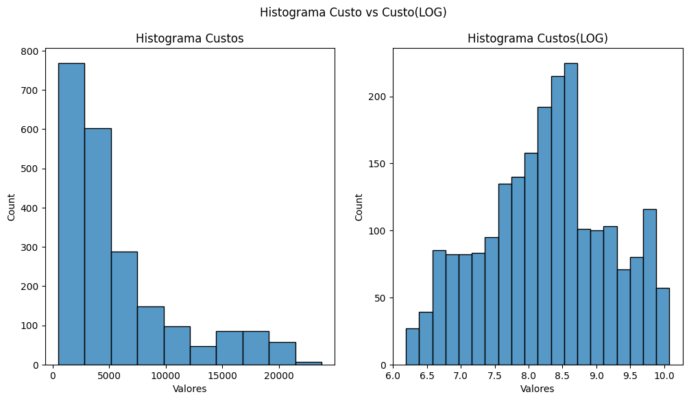
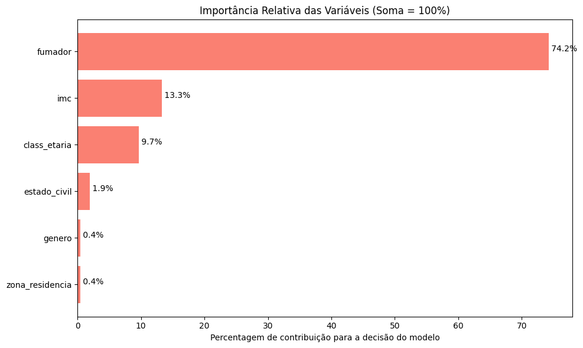
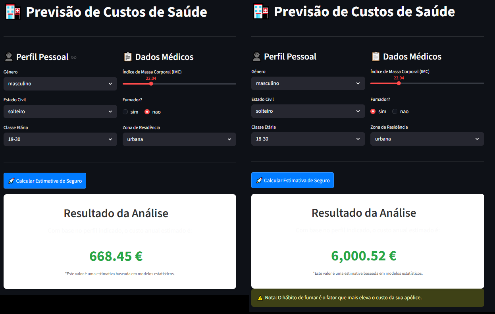

# 🏥 Previsão de Custos de Seguro de Saúde com Machine Learning 

Projeto de **Machine Learning** desenvolvido para prever o **custo de um seguro de saúde** com base em características demográficas e comportamentais dos indivíduos.

O objetivo é construir um modelo capaz de estimar o custo esperado utilizando técnicas de **pré-processamento, engenharia de features, pipelines e otimização de hiperparâmetros**.

---

# 📊 Dataset

O dataset contém **2215 registos** e **7 variáveis** relacionadas com características pessoais e hábitos de saúde.

### Features

| Variável        | Descrição                         |
| --------------- | --------------------------------- |
| genero          | Masculino / Feminino              |
| estado_civil    | Estado civil do indivíduo         |
| zona_residencia | Região onde vive                  |
| imc             | Índice de Massa Corporal          |
| fumador         | Se é fumador                      |
| class_etaria    | Classe etária                     |
| custo           | Custo do seguro de saúde (Target) |

Target:

```
custo
```

Valor contínuo que representa o custo do seguro.

---

# 🧹 Pré-processamento de Dados

Foram aplicadas várias etapas de limpeza e preparação:

### 1️⃣ Verificação de dados

* Valores nulos
* Registos duplicados

Remoção de duplicados:

```python
df.drop_duplicates(keep='first', inplace=True)
```

---

### 2️⃣ Análise de Outliers

Foi realizada análise de outliers utilizando **Boxplot**.



Foram analisadas duas variáveis:

* **IMC**
* **Custo**

---

### 3️⃣ Tratamento de Outliers

Para a variável `custo` foi utilizado o método **IQR** com um fator ajustado de **3.3** para evitar remoção excessiva de dados.

```python
limite_inferior = Q1 - 3.3 * IQR
limite_superior = Q3 + 3.3 * IQR
```

Após testes experimentais verificou-se que:

* remover outliers do custo aumentou o score do modelo
* o score passou de **0.58 → 0.80**

Outliers de `imc` também foram removidos utilizando **1.5 × IQR**.

---

# 🔢 Transformação do Target

A variável `custo` apresentava **forte assimetria (cauda à direita)**.

Para reduzir o impacto de valores extremos foi aplicada transformação logarítmica:

```python
y_log = np.log1p(y)
```

Comparação entre distribuição original e transformada:



Para automatizar o processo foi utilizado:

```
TransformedTargetRegressor
```

que aplica:

```
log no treino
exp na previsão
```

---

# ⚙️ Pipeline de Machine Learning

Foi criada uma **pipeline completa** para garantir um fluxo consistente de processamento.

### Processamento de variáveis

**Variáveis numéricas**

```
StandardScaler
```

**Variáveis categóricas**

```
OneHotEncoder
```

**Variáveis binárias**

```
genero
fumador
```

foram convertidas para 0 e 1.

Pipeline:

```
ColumnTransformer
→ StandardScaler
→ OneHotEncoder
→ SVR
```

---

# 🤖 Modelo Utilizado

Modelo principal:

```
Support Vector Regression (SVR)
```

A otimização de hiperparâmetros foi feita com:

```
GridSearchCV
```

Parâmetros testados:

* kernel: linear, rbf
* C
* epsilon
* gamma

Validação cruzada:

```
cv = 5
```

---

# 📈 Resultados

### Score médio (Cross Validation)

```
0.82
```

### Métricas no conjunto de teste

| Métrica | Resultado |
| ------- | --------- |
| MAE     | 1063.23 € |
| RMSE    | 1854.05 € |
| R²      | 0.8813    |
| MAPE    | 18.93 %   |

Interpretação:

* O modelo explica **88% da variabilidade dos custos**
* O erro médio é cerca de **1063€**

---

# 📊 Importância das Variáveis

Foi utilizada **Permutation Importance** para avaliar o impacto de cada feature no modelo.



Este método mede a **queda no desempenho do modelo quando uma variável é embaralhada**, indicando a sua importância relativa.

---

# 🧠 Tecnologias Utilizadas

* Python
* Pandas
* NumPy
* Seaborn
* Matplotlib
* Scikit-learn
* Joblib

---

# Aplicação Interativa (Streamlit)

Foi desenvolvida uma aplicação interativa com **Streamlit** que permite inserir manualmente as características de um indivíduo e obter a previsão do **custo estimado do seguro de saúde** com base no modelo treinado.

Exemplo da interface:



A aplicação permite:

* Introduzir dados do utilizador (género, estado civil, zona de residência, IMC, classe etária e hábito de fumar)
* Utilizar o modelo de **Machine Learning** treinado para prever o custo do seguro
* Visualizar o valor estimado do seguro de saúde de forma imediata

---

# 📁 Estrutura do Projeto

```
seguros-ml
│
├── data
│   └── dataset.csv
│
├── models
│   └── seguros_saude.pkl
│
├── Images
│   ├── custosVScustos_log.png
│   ├── Importancia_features.png
│   └── Outliers.png
│
├── notebook.ipynb
│
├── requirements.txt
└── README.md
```

---

# Como Executar o Projeto

### 1️⃣ Clonar o repositório
git clone https://github.com/FranciscoG08/Previsao_Seguros_Saude_StreamLit.git
### 2️⃣ Instalar dependências
pip install -r requirements.txt
### 3️⃣ Executar aplicação Streamlit
streamlit run seguros_saude_streamlit.py

---

# 💾 Guardar Modelo

O modelo final foi guardado para utilização futura:

```python
import joblib

joblib.dump(modelo_otimo, "models/seguros_saude.pkl")
```

---

# 🚀 Objetivo do Projeto

Este projeto demonstra a aplicação de técnicas de **Machine Learning para regressão**, incluindo:

* limpeza de dados
* tratamento de outliers
* transformação de variáveis
* pipelines de processamento
* otimização de hiperparâmetros
* interpretação do modelo

---

# 👤 Autor

**Francisco Guedes**
